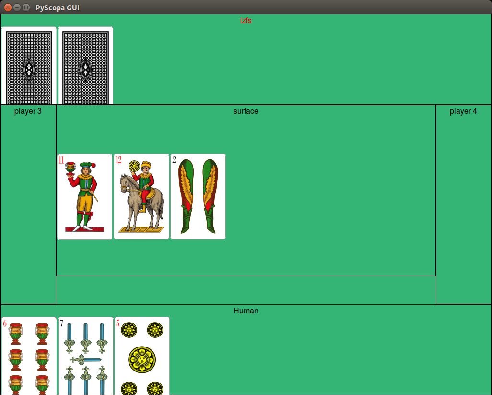

# pyscopa
Python version of Italian card game Scopa

# Info
This is a python implementation of the Italian card game Scopa. It can support 2, 3 or 4 players.



# Prerequisites
- python3
- guizero

# Installation

Install all the required python modules by running:

`pip3 install -r requirements.txt`

# Run the game
The script main has 3 parameters:
```
  -g, --gui                       Enable gui
  -p, --human                     Enable Human player
  -n {2,3,4}, --n_players {2,3,4} Number of players
```

